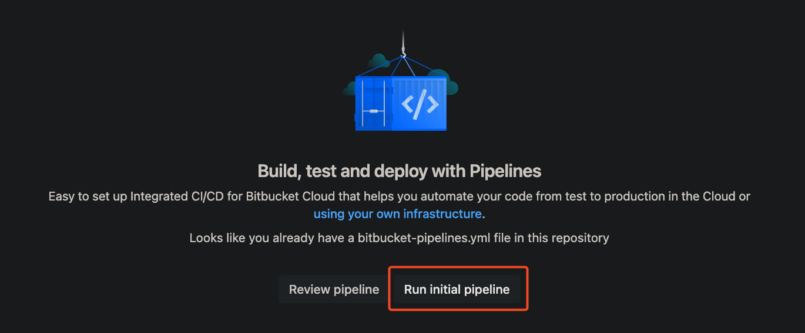

# 01_06 Challenge: Optimize a Workflow in Bitbucket Pipelines

## Challenge Scenario

In this challenge you’re the Bitbucket Pipelines expert supporting development on the Amazing Mobile App.

The Data Analysis team has developed a Python script to run a cluster analysis using machine learning. This script processes a large dataset stored in a JSON file and generates an analysis report.

The Data Analysis team is facing challenges with execution time and resource usage, and they’ve asked you to optimize their **Bitbucket Pipelines** workflow.

Specifically, they need a pipeline that:

1. Prevents the analysis from running more than 10 minutes
1. Minimizes the time spent loading data analysis libraries
1. Reuses any data that has already been generated by the script and written to the `./data` directory in the workspace
1. Only runs the analysis when the [cluster analysis](./cluster_analysis.py) script has changed.

Review the current pipeline configuration and make changes to optimize the pipeline as requested.

## Challenge Tasks

1. Log into Bitbucket and create a new repository.
1. Add the exercise files.
1. From the **Pipelines** menu, run the pipeline once to enable pipeline settings.

    

    

1. Review the pipeline to get an idea of the pipeline performance before making any changes.
1. Update the [pipeline configuration](./bitbucket-pipelines.yml) to meet the specifications provided by the Data Analysis team.

> [!NOTE]
> Use the topics from this chapter to solve the challenge, specifically: `max-time`, `caches`, and `conditions`.

This challenge should take 10-15 minutes to complete.

<!-- FooterStart -->
---
[← 01_05 Cache Dependencies](../01_05_cache_dependencies/README.md) | [01_07 Solution: Optimize a Workflow in Bitbucket Pipelines →](../01_07_solution_optimize_a_pipeline/README.md)
<!-- FooterEnd -->
