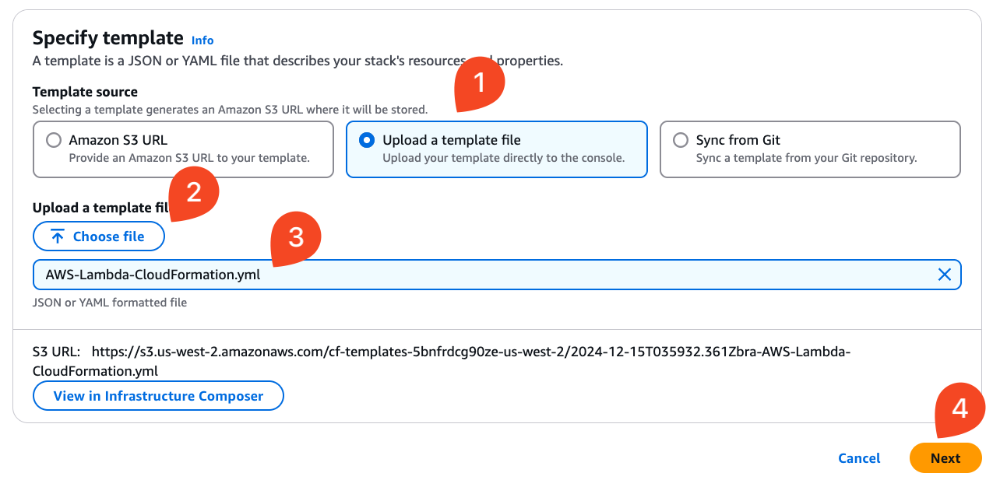
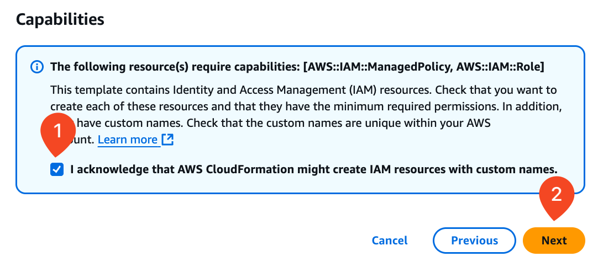
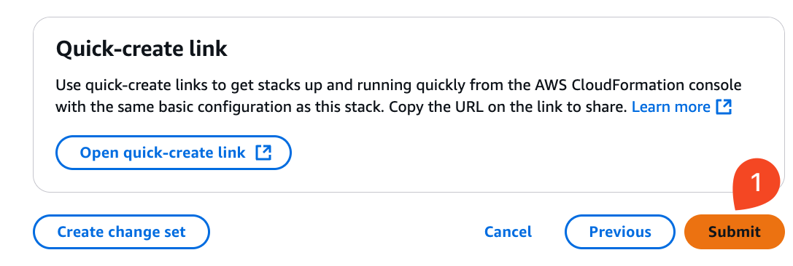
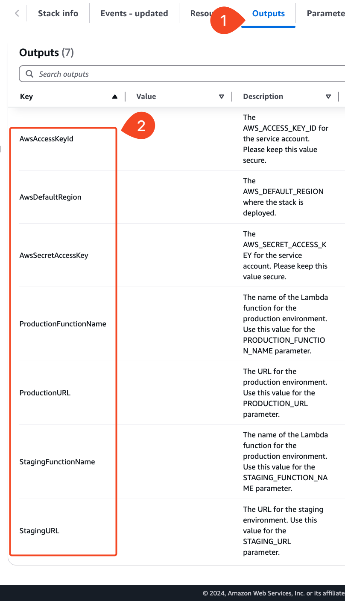

# 02_03 Set Up the AWS Environment

In this lesson you will use a CloudFormation template to deploy the AWS resources that will be used in the future lessons.

## Prerequisites

Having the following items in place before starting this lab will help you have a smooth experience.

1. [Atlassian and Bitbucket accounts](https://bitbucket.org/product) are required to host the code for the sample application.
1. An [Amazon Web Services account](https://aws.amazon.com/free/) is needed to deploy the sample application used for the deployment target.
1. The exercise files for this lesson should be downloaded and accessible on your local system.

## Deploy the CloudFormation Template

1. Log into your AWS account.  Access the CloudFormation homepage and select **Create stack**.

    

1. On the create stack screen, select **Upload a template file** and then  select **Choose file**.

    Using your system's file finder, browse to the location where the CloudFormation template is located.

    Select the file [AWS-Lambda-CloudFormation.yml](./AWS-Lambda-CloudFormation.yml).

    Select **Next**.

    

1. On the "**Specify stack details**" screen, **enter a stack name**.  Select **Next**.

    

1. On the "**Stack options**" screen, scroll down to the very bottom.

    Acknowledge that AWS CloudFormation might create IAM resources with custom names, and then select **Next**.

    

1. On the "Review and create" screen, scroll down to the bottom and select **Submit**.

    

1. Selecting submit starts the stack creation process.

    

    Wait 2-3 minutes for the stack deployment to complete.

    

1. After the creation is complete, select the **Outputs** tab to see the values for:

    - AwsAccessKeyId [^1]
    - AwsDefaultRegion
    - AwsSecretAccessKey
    - ProductionFunctionName
    - ProductionURL
    - StagingFunctionName
    - StagingURL

    > [!WARNING] The values for `AwsAccessKeyId` and `AwsSecretAccessKey` are sensitive.  Treat them as your would a username and password.  Do not store them in publicly available repositories, files, or documents.

    

1. To validate the deployment, open the links for the **ProductionURL** and **StagingURL**.

    

    

[^1]: WARNING! The values for `AwsAccessKeyId` and `AwsSecretAccessKey` are sensitive.  Treat them as your would a username and pa    ssword.  Do not store them in publicly available repositories, files, or documents.

<!-- FooterStart -->
---
[← 02_02 Use a pipe in a pipeline configuration](../02_02_use_a_pipe_in_a_pipeline_configuration/README.md) | [Advanced Bitbucket Pipelines: Automating Deployments & Managing Third Party Integrations →](../../README.md)
<!-- FooterEnd -->
