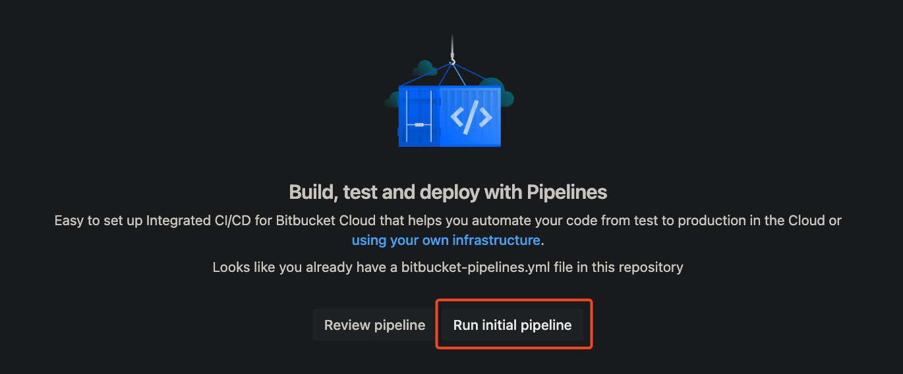
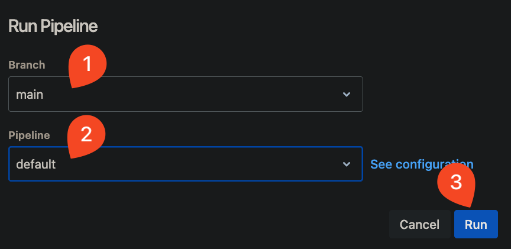

# 02_05 Challenge: Use Pipes in a Pipeline

## Challenge Scenario

In this challenge you’re continuing your role as the Bitbucket Pipelines expert supporting the Amazing Mobile App.

Everyone on the team is excited about using Bitbucket Pipelines to automate their workflows. Management is pleased with the velocity of feature development and it looks like this is going to be an amazing year for the company.

As planning begins for the next fiscal year, the CFO has come to you and asked if there's a way to get a report of the build minutes being used across all of the companies repositories.  Specifically, they need to know which builds are taking the longest amount of time and how many build minutes are being used.  They'd also like to capture this information on a regular basis.

Use your knowledge of Bitbucket Pipelines to automate a solution for the CFO.

## Challenge Tasks

1. Log into Bitbucket and create a new repository.  Add the provided [bitbucket-pipelines.yml](./bitbucket-pipelines.yml) file.
1. From the **Pipelines** menu, run the pipeline once to enable pipeline settings.

    

    

1. Create a repository access token that you can use to collect the desired information.  The token must have the following permissions:

    - `Repositories:Write`
    - `Pipelines:Read`

1. Store the token as a repository variable named `STATISTICS_ACCESS_TOKEN`.
1. Use the following script element to format the report name:

    ```bash
    export FILENAME="builds-statistics-$(date +%Y-%m-%d).txt"
    ```

1. Use the following pipes to generate and store the report:

    - [atlassian/bitbucket-build-statistics](https://bitbucket.org/atlassian/bitbucket-build-statistics/src/master/)

        ```yaml
        - pipe: atlassian/bitbucket-build-statistics:1.5.3
          variables:
            BITBUCKET_ACCESS_TOKEN: "$STATISTICS_ACCESS_TOKEN"
            FILENAME: "$FILENAME"
        ```

    - [atlassian/bitbucket-upload-file](https://bitbucket.org/atlassian/bitbucket-upload-file/src/master/)

        ```yaml
        - pipe: atlassian/bitbucket-upload-file:0.7.4
          variables:
            BITBUCKET_ACCESS_TOKEN: "$STATISTICS_ACCESS_TOKEN"
            FILENAME: "$FILENAME"
        ```

This challenge should take 10-15 minutes to complete.

<!-- FooterStart -->
---
[← 02_04 Use a pipe to deploy code to AWS Lambda](../02_04_use_a_pipe_to_deploy_code_to_aws_lambda/README.md) | [02_06 Solution: Use Pipes in a Pipeline →](../02_06_solution_use_pipes_in_a_pipeline/README.md)
<!-- FooterEnd -->
