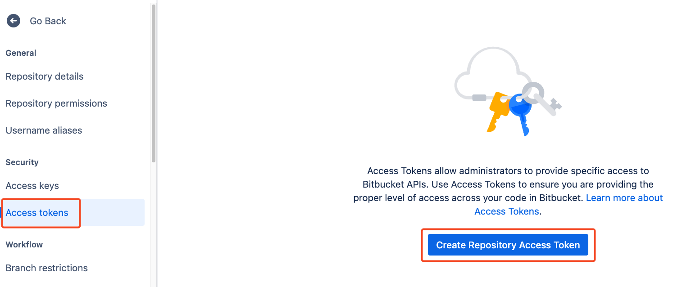
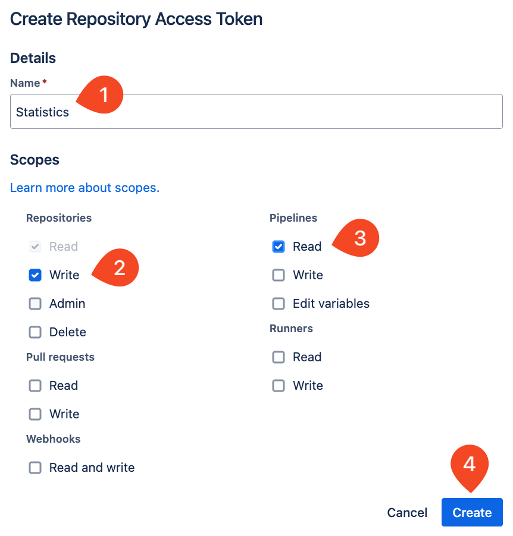
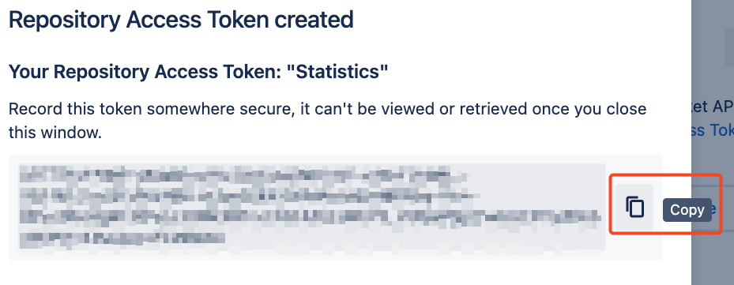
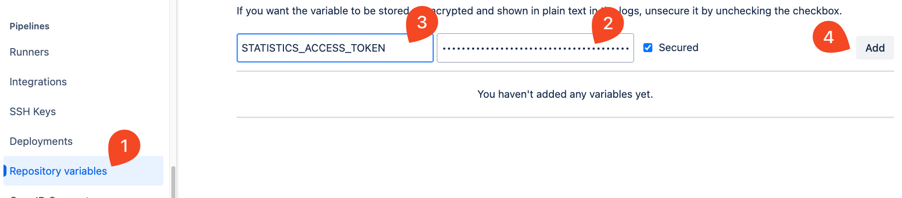
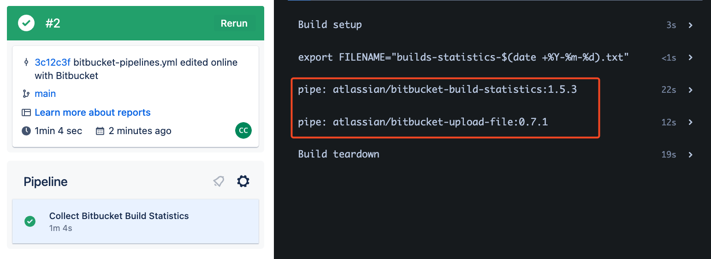
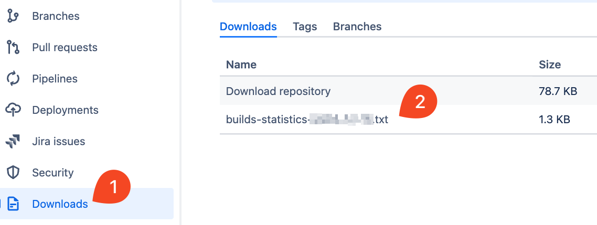

# 02_06 Solution: Use Pipes in a Pipeline

## Challenge Scenario

In this challenge you're continuing your role as the Bitbucket Pipelines expert supporting the Amazing Mobile App.

As planning begins for the next fiscal year, the CFO has come to you and asked if there's a way to get a report of the build minutes being used across all of the companies repositories.  Specifically, they need to know which builds are taking the longest amount of time and how many build minutes are being used.  They'd also like to capture this information on a regular basis.

Use your knowledge of Bitbucket Pipelines to automate a solution for the CFO.

## Challenge Tasks

1. Log into Bitbucket and create a new repository.
1. Create a repository access token that you can use to collect the desired information.  The token must have the following permissions:

    - `Repositories:Write`
    - `Pipelines:Read`

1. Store the token as a repository variable named `STATISTICS_ACCESS_TOKEN`.
1. Use the following script element to format the report name:

    ```bash
    export FILENAME="builds-statistics-$(date +%Y-%m-%d).txt"
    ```

1. Use the following pipes to generate and store the report:

    - [atlassian/bitbucket-build-statistics](https://bitbucket.org/atlassian/bitbucket-build-statistics/src/master/)

        ```yaml
        - pipe: atlassian/bitbucket-build-statistics:1.5.3
        variables:
          BITBUCKET_ACCESS_TOKEN: $STATISTICS_ACCESS_TOKEN
          FILENAME: "$FILENAME"
        ```

    - [atlassian/bitbucket-upload-file](https://bitbucket.org/atlassian/bitbucket-upload-file/src/master/)

        ```yaml
          - pipe: atlassian/bitbucket-upload-file:0.7.1
            variables:
              BITBUCKET_ACCESS_TOKEN: $STATISTICS_ACCESS_TOKEN
              FILENAME: "*.txt"
        ```

This challenge should take 10-15 minutes to complete.

## Solution

Create a new repository and add the exercise files.

Run the pipeline once to make sure pipelines are enabled and working before proceeding.

### Create an Access Token

1. Select **Repository settings** -> **Access tokens** -> **Create Repository Access Token**.

    

1. Name the token `Statistics`.
1. Select the permission to include:

    - `Repositories:Write`
    - `Pipelines:Read`

   Select **Create**.

    

1. Select the stacked squares icon for the first entry in the list of tokens to copy the token to my clipboard. Click out of the dialog.

    

1. Select **Repository variables**.
1. Paste the value for the access token into the second field and then enter the name `STATISTICS_ACCESS_TOKEN`. Select **Add**.

    

### Create the Pipeline Configuration

1. Edit the pipeline configuration.
1. Add a cache for `docker`.

    

1. Add the following script elements as described in the challenge task list:

    1. export the filename as an environment variable using the format indicated
    1. add a pipe to generate the build statistics report
    1. add a pipe to write the report to the **Downloads** page in the repository

### Check the Results

1. Run the pipeline and confirm that the report is generated as expected.

    

1. From the left-side menu, select **Downloads**.
1. Select the most recently generated report and save it to your local system.
1. Review the contents of the report.

    

The completed pipeline should be similar to the following: [bitbucket-pipelines.yml](./bitbucket-pipelines.yml)

```yaml
image: atlassian/default-image:4

pipelines:
  default:
    - step:
        name: Collect Bitbucket Build Statistics
        caches:
          - docker
        artifacts:
          - "*.txt"
        script:

          - export FILENAME="builds-statistics-$(date +%Y-%m-%d).txt"

          - pipe: atlassian/bitbucket-build-statistics:1.5.3
            variables:
              BITBUCKET_ACCESS_TOKEN: $STATISTICS_ACCESS_TOKEN
              FILENAME: "$FILENAME"

          - pipe: atlassian/bitbucket-upload-file:0.7.1
            variables:
              BITBUCKET_ACCESS_TOKEN: $STATISTICS_ACCESS_TOKEN
              FILENAME: "*.txt"
```

<!-- FooterStart -->
---
[← 02_05 Challenge: Use Pipes in a Pipeline](../02_05_challenge_use_pipes_in_a_pipeline/README.md) | [03_01 When to Use Custom Pipes →](../../ch3_create_custom_pipes/03_01_when_to_use_custom_pipes/README.md)
<!-- FooterEnd -->
