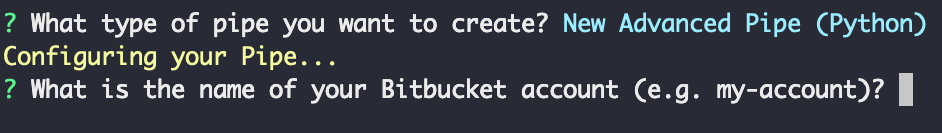
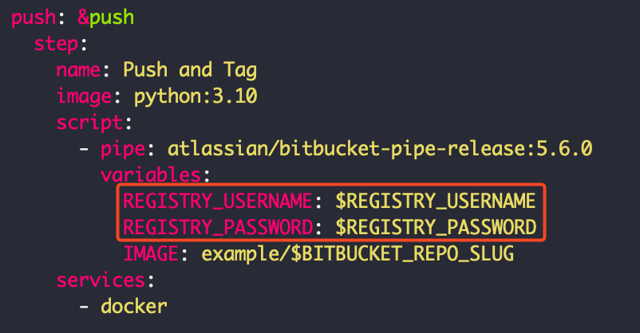
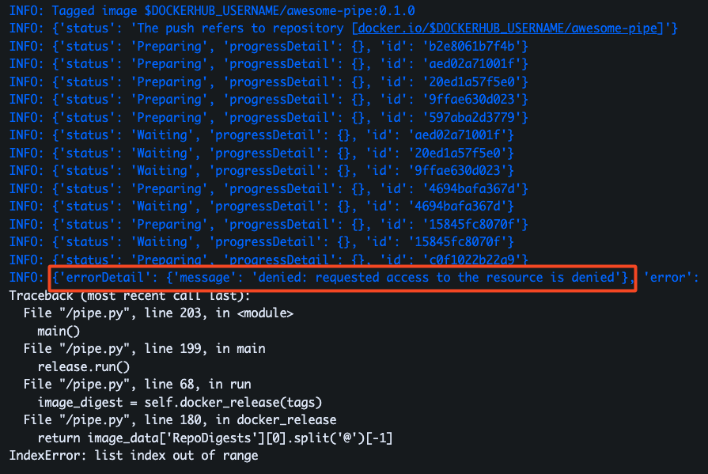

# 03_02 Develop a Custom Pipe

## Using the Pipeline Generator

> [!IMPORTANT]
> Your local system will need to have [Node.js](https://nodejs.org/en) and the [NPM package manager](https://www.npmjs.com/) installed to use the pipeline generator.
>
> You should have a [Docker Hub](https://hub.docker.com/) account before proceeding.

The [bitbucket-pipes generator](https://www.npmjs.com/package/generator-bitbucket-pipe) is useful for quickly getting started with pipe development.  Its as easy as `1`, `2`, `3`.

| #  | Step  | Details / Commands |
|----|-------|--------------------|
|1   | Create a Bitbucket repo and clone it to your local system | `git clone git@bitbucket.org:WORKSPACE_NAME/REPO_NAME.git` |
|1.5 | Create a branch in the repo | `git co -b feature/create-pipe` |
|2   | Use `npm` to install `yo` and `generator-bitbucket-pipes` | `npm install -g yo generator-bitbucket-pipe` |
|3   | Run the generator inside the cloned repo | `yo bitbucket-pipe` |

The wizard will prompt you to create one of the following:

- New Simple Pipe (Bash)
- New Simple Pipe (Python)
- New Advanced Pipe (Bash)
- New Advanced Pipe (Python)

> [!IMPORTANT]
> At this time, the pipeline generator supports `bash` and `python` scripts.  However, it can still be used to generate the scaffolding needed to develop a pipe environment for other languages.
>
> Just update the `Dockerfile` to support the target runtime and remove other files as needed.

You can use the following links to review the files created by the pipe generator:

| Pipe template   | Generated Script                                         |
|---------------- |----------------------------------------------------------|
| advanced-python | [Advanced Python script](./advanced-python/pipe/pipe.py) |
| advanced-bash   | [Advanced Bash script](./advanced-bash/pipe/pipe.sh)     |
| simple-python   | [Simple Python script](./simple-python/pipe.py)          |
| simple-bash     | [Simple Bash script](./simple-bash/pipe.sh)              |

### Simple Pipe

Selecting **New Simple Pipe** will create the following files in the current directory:

| File                    | Description                                                                |
|-------------------------|----------------------------------------------------------------------------|
| bitbucket-pipelines.yml | Pipeline configuration for testing and deploying the pipe to Docker Hub    |
| Dockerfile              | Docker configuration to create the pipe's image                            |
| pipe.sh or pipe.py      | A script template                                                          |
| requirements.txt        | Libraries to install for Python pipes                                      |

### Complete / Advanced Pipe

> [!IMPORTANT]
> The "Advanced Pipe" is also known as the "Complete Pipe".



> [!WARNING]
> When the wizard asks _"What is the name of your Bitbucket account (e.g. my-account)?"_ Enter the **WORKSPACE** that contains the repo for the pipe.  Entering your Bitbucket account name will cause 404s in the  generated URLs for the pipe

> [!WARNING]
> The values you provide in response to _"What your repository name (e.g. ftp-deploy)?"_[^1] and _"What is your Docker Hub account (e.g. atlassian)?"_ will be used to generate the pipeline script for pushing the pipe image to a Docker Hub repository.  Edit the `bitbucket-pipelines.yml` to resolve any conflicts.

Selecting **New Advanced Pipe** will create the following files in the current directory:

| File                      | Description |
|---------------------------|-------------|
| bitbucket-pipelines.yml   | Pipeline configuration for testing and deploying the pipe to Docker Hub |
| Dockerfile                | Docker configuration to create the pipe's image |
| pipe.yml                  | Metadata file describing the pipe's inputs, outputs and configuration |
| pipe/pipe.sh or pipe.py   | Main pipe implementation script in Bash or Python |
| test/requirements.txt     | Test dependencies for Python-based test suites |
| test/test.bats or test.py | Test suite implementation in Bash or Python |
| requirements.txt          | Python package dependencies for Python-based pipes |
| LICENSE.txt               | License terms for the pipe |
| README.md                 | Documentation and usage instructions |
| RELEASING.md              | Instructions for releasing new versions |
| .editorconfig             | Code style configuration |
| .gitignore                | Git ignore patterns |

## Developing Your Pipe

After you have the pipe template files in place, implement your custom solution.  Again, easy as `1`, `2`, `3`.

> [!IMPORTANT]
> Note the `2.5` step for installing and running the `semversioner` command.
> Having it in place will be key to getting your code deployed using the provided pipeline configuration which uses the `atlassian/bitbucket-pipe-release` pipe.  Semantic versioning tracking is required by the release pipe.


| #   | Step  | Details / Commands |
|-----|-------|--------------------|
| 1   | Edit `pipe.py` or `pipe.sh` | Use your favorite editor or IDE to add your code to the provided scripts |
| 2   | Add your custom code | Update the script to implement your goals, dreams, and aspirations |
| 2.5 | Add semantic versioning<br>[Reference for Semver usage](https://bitbucket.org/atlassian/bitbucket-pipe-release/src/master/CONTRIBUTING.md) _(scroll down to **Release process**)_ | `pip install semversioner`<br>`semversioner add-change --type minor --description "create pipe"` |
| 3   | Push the code to the repo | `git add .`<br>`git commit -m 'create pipe'`<br>`git push --set-upstream origin feature/create-pipe` |

## Shenanigans

### Shenanigan 03_02.1: Which Variable is the Pipeline Looking For? `DOCKERHUB_` or `REGISTRY_`?

Depending on the template you select using the `bitbucket-pipe` template, you may see the following:

> Note: Add the repository variables "DOCKERHUB_USERNAME" and "DOCKERHUB_PASSWORD" to Bitbucket Pipelines.

However, the pipeline configuration may not use those variables, instead favoring `REGISTRY_USERNAME` and `DOCKERHUB_USERNAME`:



As a result, you may see errors in your pipeline run:



### Shenanigan 03_02.2-PART_1: The History of Bitbucket URLs with Account Name vs Workspace Name

> Why does `yo bitbucket-pipe` ask for "account name"?

Let's get into it.

Some time ago, Bitbucket used your account name to create URLs.  So you could reference repositories like this:

```text
https://bitbucket.org/ACCOUNT_NAME/REPO_NAME/src/main/
```

At some point, Atlassian changed the approach to use workspace names instead of account names for repo URLs.  So now things look like this:

```text
https://bitbucket.org/WORKSPACE_NAME/REPO_NAME/src/main/
```

I'm not sure what prompted the change, but I wonder if it was related to people changing their account names and not being able to find repositories.

This article gives some insight into the ramifications of changing a workspace name: [Change a workspace ID](https://support.atlassian.com/bitbucket-cloud/docs/change-a-workspace-id/).

> Changing your workspace ID will change the URL for all associated repositories, snippets, and any static websites you're hosting on Bitbucket Cloud.

I'm sure those same things would apply to a situation where the account name was used for URLs and then changed to something else.

## Shenanigan 03_02.2-PART_2: The Lingering Affects of Bitbucket URLs with Account Name vs Workspace Name

I've looked but can't find the repo for the `generator-bitbucket-pipe` code. It looks like the [oldest version for the NPM package](https://www.npmjs.com/package/generator-bitbucket-pipe/v/0.1.0) was published 6 years ago as of January 2024.

This leads to the assumption that when the generator was written, Bitbucket still allowed for account names in repository URLs.  Which then leads to the use of the following prompt:

```text
What is the name of your Bitbucket account (e.g. my-account)?
```

Unfortunately, the code hasn't been updated to match the new way of organizing content on the Atlassian and Bitbucket platforms.

The morals of this history lesson are:

- respond to the prompt with your workspace name (not your account name!)
- if you can, try to keep your code up to date with changes :)

[^1]: That's Atlassian's grammar...not mine! :D ~MJ

<!-- FooterStart -->
---
[← 03_01 When to Use Custom Pipes](../03_01_when_to_use_custom_pipes/README.md) | [Bitbucket Pipelines Pipe: example →](advanced-python/README.md)
<!-- FooterEnd -->
