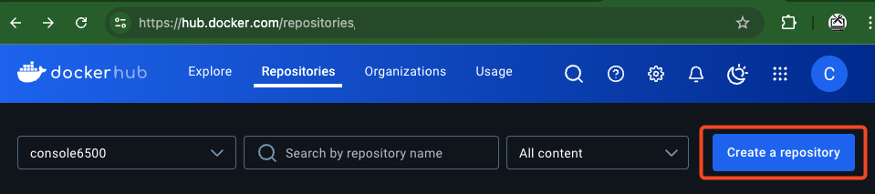
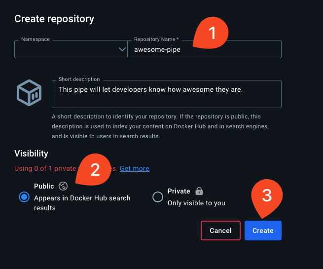
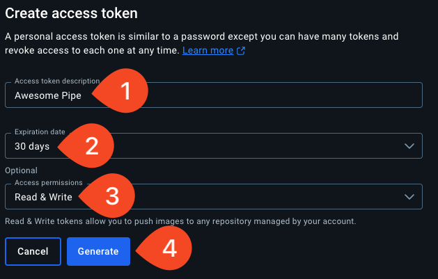
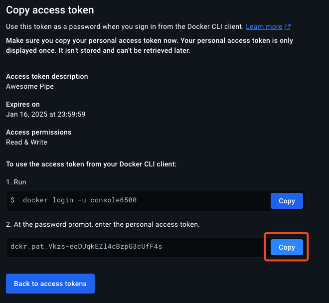
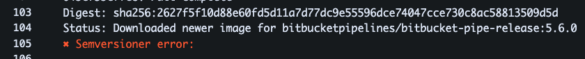

# 03_04 Deploy a Custom Pipe to a Container Registry

Start by enabling Pipelines in the repository settings.

Then get set up Docker Hub.

## Setting Up an Image Repository on Docker Hub

Follow these steps to create a repository, generate an access token, and securely store the registry credentials as repository variables.

### 1. Create a Repository on Docker Hub

1. Go to [Docker Hub](https://hub.docker.com) and log into your account.

1. Click **"Create a repository"** on the **Repositories** page.

   

1. In the **Create repository** form:

   - Enter a **Repository Name** (e.g., `awesome-pipe`).
   - Choose **Public Visibility**.
   - Click **Create**.

   

### 2. Generate a Personal Access Token

1. Navigate to **Account Settings**.  Under **Security** select **Access Tokens**.
2. Click **Create Token** and fill in:

   - **Access token description**: (e.g., `Awesome Pipe`).
   - **Expiration date**: Choose duration (e.g., `30 days`).
   - **Access permissions**: Select **Read & Write**.

   

3. Click **Generate**.

### 3. Copy the Access Token

1. Once the token is generated, copy it immediately as it **will not be shown again**.
2. Use the **Copy** button to store it securely.

   

### 4. Securely Store Your Credentials in Bitbucket Pipelines

1. Navigate to your Bitbucket Repository settings → **Repository Variables**.
2. Add the following secured variables:
3. Make sure **Secured** is checked to mask sensitive information.

   - **`REGISTRY_USERNAME`**: Your Docker Hub username.
   - **`REGISTRY_PASSWORD`**: The personal access token you copied.

   

## Merge the Branch

1. Use a pull request to merge the feature branch into the main branch.

1. The merge will trigger a pipeline run that pushes the image to Docker Hub.

1. Confirm the pipeline completes successfully. Resolve any errors as needed to get the image pushed.

## Shenanigans

### 03_04.1: Semantic Versioning

If you see the following error in your pipeline:

...its because a change file with semantic versioning is not in place.

TODO: Add more details on semantic versioning

- [Bitbucket pipe release v5.6.1 has a Semversioner error]()https://community.atlassian.com/t5/Bitbucket-questions/Bitbucket-pipe-release-v5-6-1-has-a-Semversioner-error/qaq-p/2677152)
-

<!-- FooterStart -->
---
[← pytest cache directory #](../03_03_test_a_custom_pipe/advanced-python/.pytest_cache/README.md) | [03_05 Use a custom pipe in a pipeline →](../03_05_use_a_custom_pipe_in_a_pipeline/README.md)
<!-- FooterEnd -->
