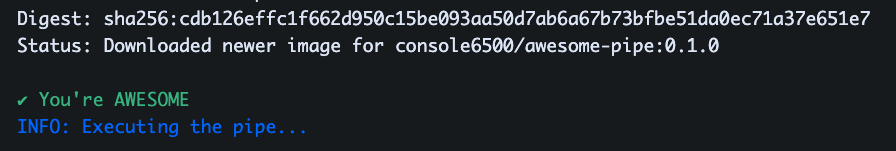

# 03_05 Use a custom pipe in a pipeline

TODO: Add some steps here

## Shenanigans

### 03_05.1: The Log Output for the Custom Pipe may be Truncated.

When the custom pipeline developed in the previous lesson is run, the output from the log is cut off.

No worries!  Just refresh the browser window and take another look.

<!-- FooterStart -->
---
[← 03_04 Deploy a Custom Pipe to a Container Registry](../03_04_deploy_a_custom_pipe_to_a_container_registry/README.md) | [03_06 Challenge: Develop a Custom Pipe →](../03_06_challenge_create_a_custom_pipe/README.md)
<!-- FooterEnd -->
