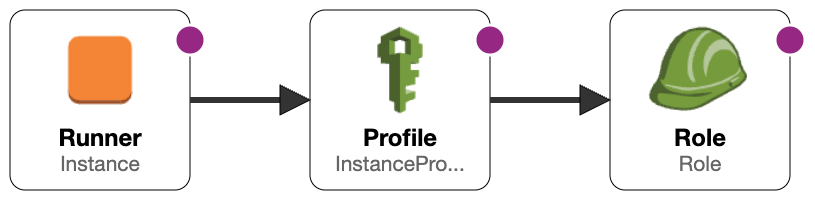
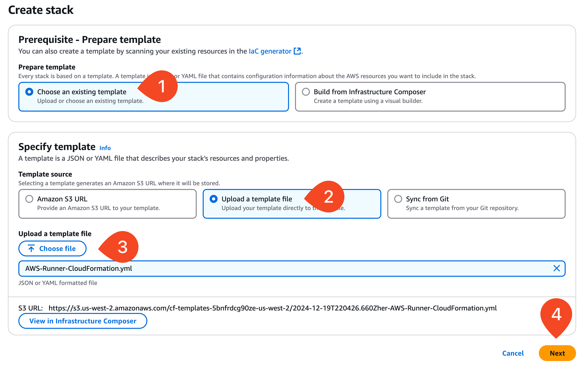
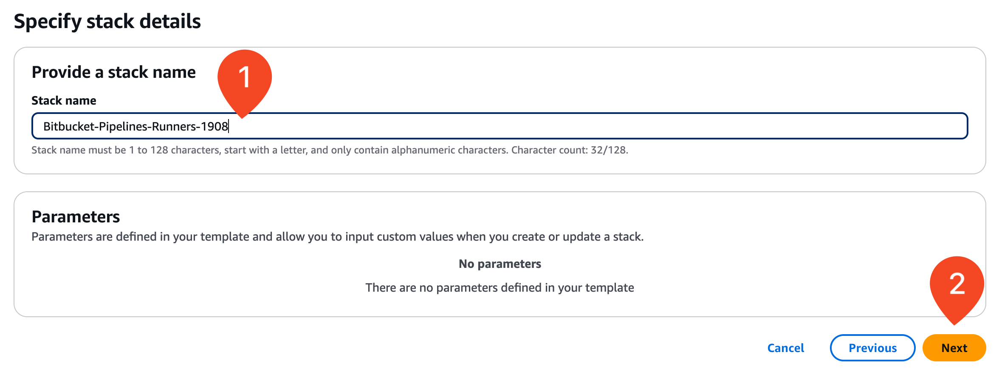
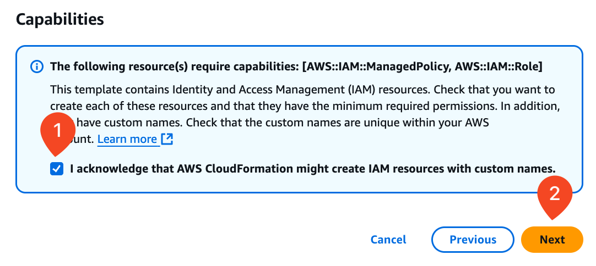
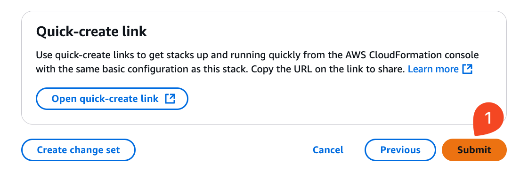
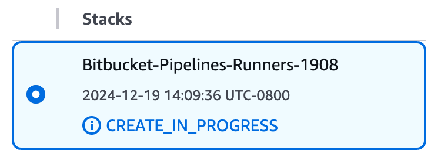
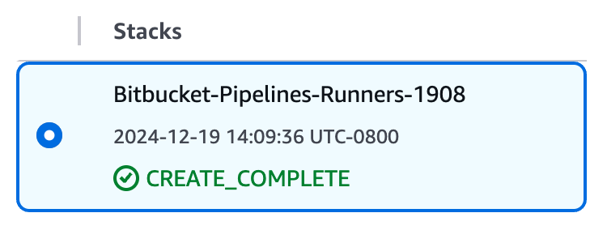
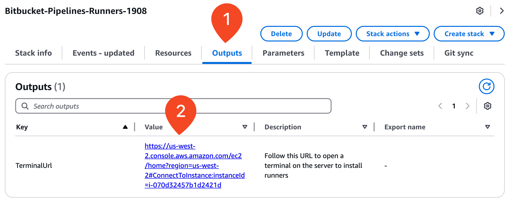
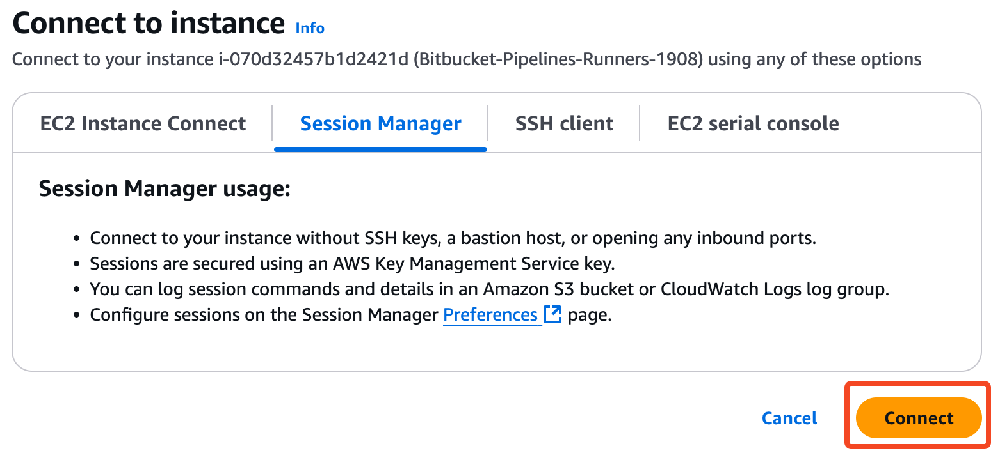
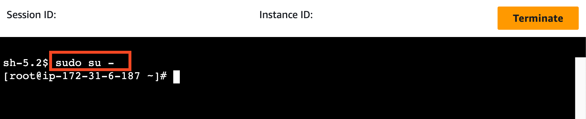

# 04_03 Deploy Linux runners in AWS

In this lesson you will use a CloudFormation template to deploy the AWS resources that will be used to create self-hosted runners.



The template deploys an EC2 instance that meets all the requirements for deploying **Linux Docker** and **Linux Shell** runners including:

TODO: add links to the resources in the following table:

| Requirement             | Configuration                          |
|-------------------------|----------------------------------------|
| 64 Bit Operating System | [Amazon Linux 2023](https://aws.amazon.com/linux/amazon-linux-2023/) TODO: Add version |
| 8 GB RAM                | Instance type is [`m6i.large`](https://aws.amazon.com/ec2/instance-types/m6i/)            |
| OpenJDK                 | [Amazon Corretto](https://aws.amazon.com/corretto/) version TODO: Add version|
| Git                     | Git TODO: Add version                   |
| Docker                  | Docker TODO: Add version                |

## Prerequisites

Having the following items in place before starting this lab will help you have a smooth experience.

1. [Atlassian and Bitbucket accounts](https://bitbucket.org/product) are required to host the code for the sample application.
1. An [Amazon Web Services account](https://aws.amazon.com/free/) is needed to deploy the sample application used for the deployment target.
1. The exercise files for this lesson should be downloaded and accessible on your local system.

## Deploy the CloudFormation Template

1. Log into your AWS account.  Access the CloudFormation homepage and select **Create stack**.

    

1. On the create stack screen, select **Upload a template file** and then  select **Choose file**.

    Using your system's file finder, browse to the location where the CloudFormation template is located.

    Select the file [AWS-Lambda-CloudFormation.yml](./AWS-Runner-CloudFormation.yml).

    Select **Next**.

TODO: Update images starting here...(upload image)

    

1. On the "**Specify stack details**" screen, **enter a stack name**.  Select **Next**.

    

1. On the "**Stack options**" screen, scroll down to the very bottom.

    Acknowledge that AWS CloudFormation might create IAM resources with custom names, and then select **Next**.

    

1. On the "Review and create" screen, scroll down to the bottom and select **Submit**.

    

1. Selecting submit starts the stack creation process.

    

    Wait 4-5 minutes for the stack deployment to complete.

    

1. After the creation is complete, select the **Outputs** tab to see the values for:

    - **TerminalURL**: Follow this URL to open a terminal on the server to install runners

    

1. Connect to the EC2 instance using [Session Manager](https://docs.aws.amazon.com/AWSEC2/latest/UserGuide/connect-with-systems-manager-session-manager.html).

    

1. Elevate your session to become the root user by running the following command:

    ```bash
    sudo su -
    ```

    

## Proceed to the Next Lesson

With the EC2 instance in place, you're ready to set up **Linux Docker** and **Linux Shell** runners!

<!-- FooterStart -->
---
[← 04_02 Self-Hosted Runner Configurations](../04_02_self_hosted_runner_configurations/README.md) | [04_03 Add Self-Hosted Runners to a Workspace →](../04_04_add_self_hosted_runners_to_a_workspace/README.md)
<!-- FooterEnd -->
