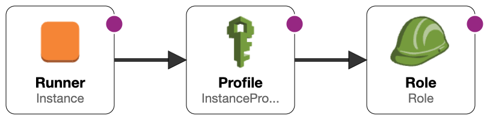
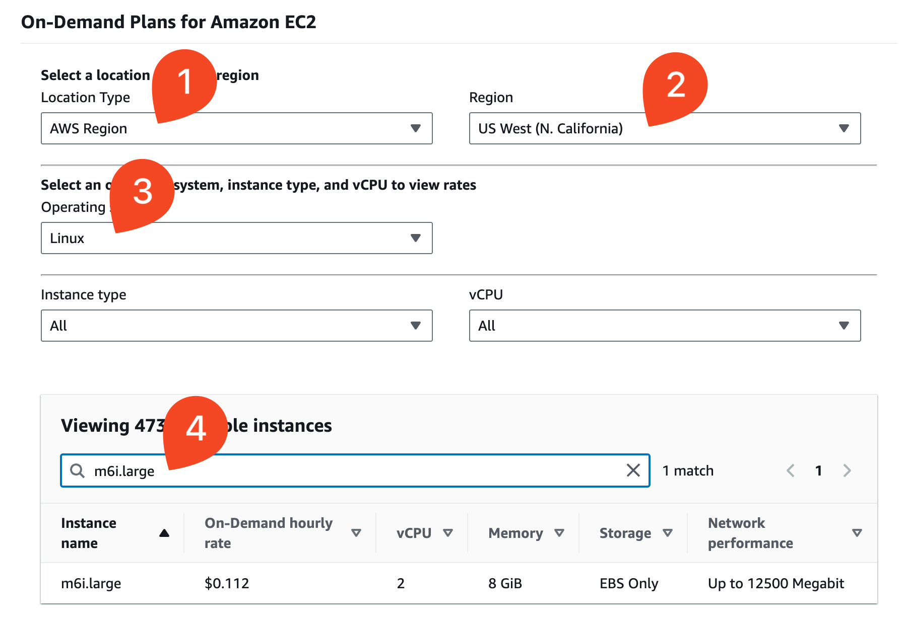
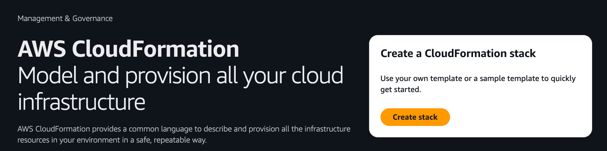
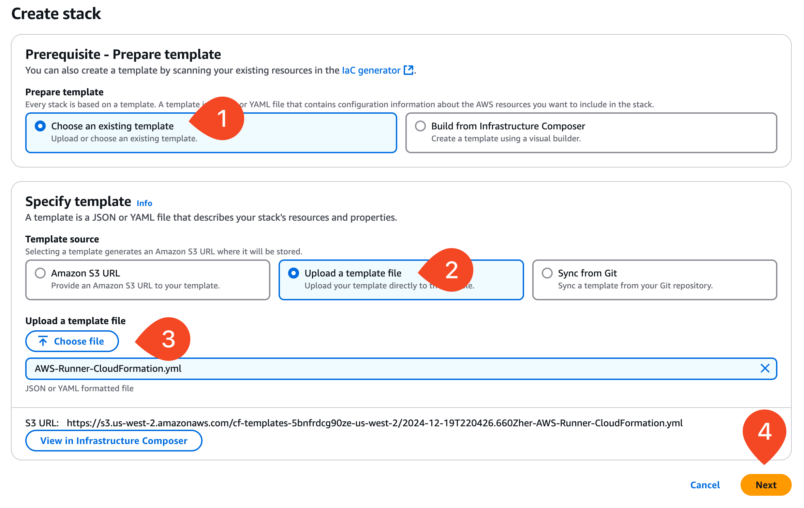
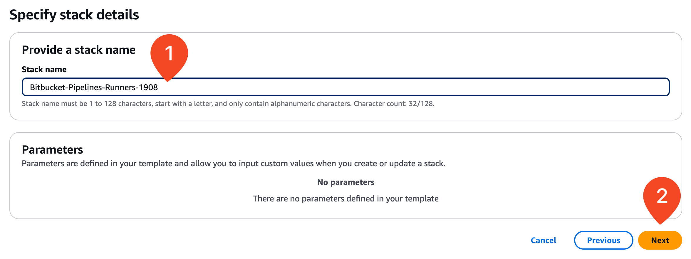
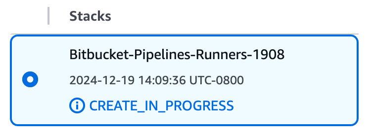
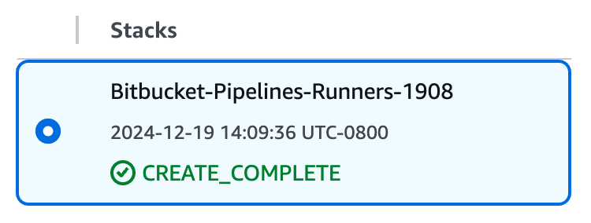
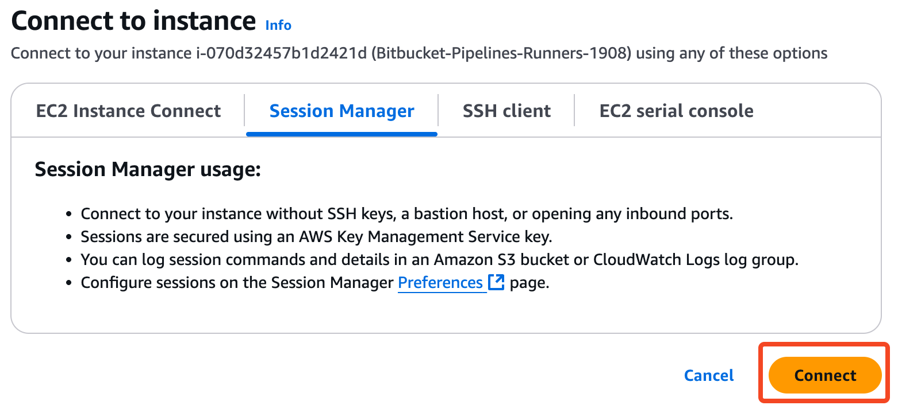
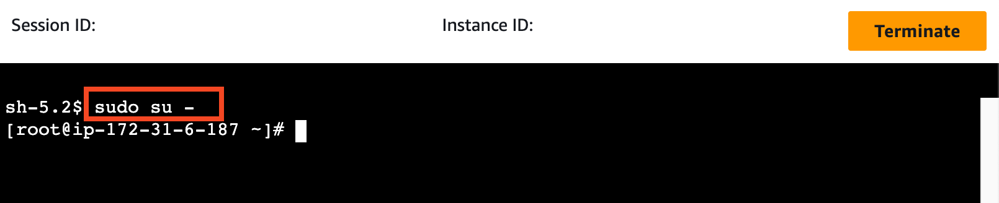

# 04_03 Deploy an EC2 Server in AWS

In this lab you will use a CloudFormation template to deploy the AWS resources that will be used to create self-hosted runners.

The template deploys an EC2 instance that meets all the requirements for deploying **Linux Docker** and **Linux Shell** runners including:

| Requirement             | Configuration                          |
|-------------------------|----------------------------------------|
| 64 Bit Operating System | [Amazon Linux 2023](https://aws.amazon.com/linux/amazon-linux-2023/) ([version 2.40.1](https://docs.aws.amazon.com/linux/al2023/release-notes/relnotes-2023.6.20241212.html)) |
| 8 GB RAM | Instance type is [`m6i.large`](https://aws.amazon.com/ec2/instance-types/m6i/) |
| OpenJDK | [Amazon Corretto](https://aws.amazon.com/corretto/)-23.0.1.8.1 (build 23.0.1+8-FR) |
| Git | [Git version 2.40.1](https://git-scm.com/) |
| Docker |  [Docker version 25.0.5, build 5dc9bcc](https://www.docker.com/products/cli/) |

## Determine EC2 Instance Hourly Pricing

Please note that the resources created in this lab will cause a cost to be incurred.

To determine the hourly cost for the resources created by this lab, open the following link and complete the steps below:

- [Amazon EC2 On-Demand Pricing](https://aws.amazon.com/ec2/pricing/on-demand/)

| **#** | **Option**       | **Selection**                                    |
|-------|------------------|--------------------------------------------------|
| **1** | Location Type    | `AWS Region`                                     |
| **2** | Region           | Select the region you plan to use for deployment |
| **3** | Operating system | `Linux`                                          |
| **4** | Instance type    | `m6i.large`                                      |

## Prerequisites

Having the following items in place before starting this lab will help you have a smooth experience.

1. [Atlassian and Bitbucket accounts](https://bitbucket.org/product) are required to host the code for the sample application.
1. An [Amazon Web Services account](https://aws.amazon.com/free/) is needed to deploy the sample application used for the deployment target.
1. The exercise files for this lesson should be downloaded and accessible on your local system.

## Deploy the CloudFormation Template

1. Log into your AWS account.  Access the CloudFormation homepage and select **Create stack**.

    

1. On the create stack screen, select **Upload a template file** and then  select **Choose file**.

    Using your system's file finder, browse to the location where the CloudFormation template is located.

    Select the file [AWS-Lambda-CloudFormation.yml](./AWS-Runner-CloudFormation.yml).

    Select **Next**.

TODO: Update images starting here...(upload image)

    

1. On the "**Specify stack details**" screen, **enter a stack name**.  Select **Next**.

    

1. On the "**Stack options**" screen, scroll down to the very bottom.

    Acknowledge that AWS CloudFormation might create IAM resources with custom names, and then select **Next**.

    

1. On the "Review and create" screen, scroll down to the bottom and select **Submit**.

    

1. Selecting submit starts the stack creation process.

    

    Wait 4-5 minutes for the stack deployment to complete.

    

1. After the creation is complete, select the **Outputs** tab to see the values for:

    - **TerminalURL**: Follow this URL to open a terminal on the server to install runners.

    

1. Connect to the EC2 instance using [Session Manager](https://docs.aws.amazon.com/AWSEC2/latest/UserGuide/connect-with-systems-manager-session-manager.html).

    

1. Elevate your session to become the root user by running the following command:

        sudo su -

    

## Proceed to the Next Lesson

With the EC2 instance in place, you're ready to set up **Linux Docker** and **Linux Shell** runners!

<!-- FooterStart -->
---
[← 04_03 Compare Repository and Workspace Runners](../04_03_compare_repository_and_workspace_runners/README.md) | [04_05 Install Runners in a Workspace →](../04_05_install_runners_in_a_workspace/README.md)
<!-- FooterEnd -->
