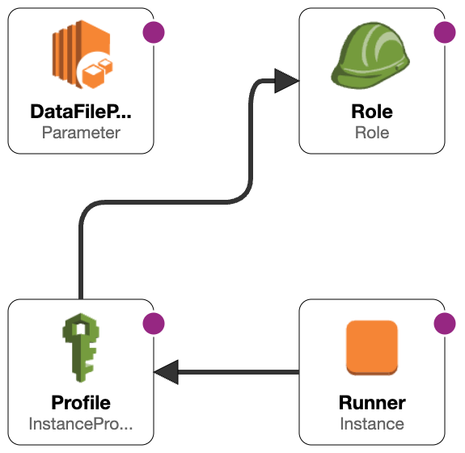

# 04_08 Solution: Deploy a Self-Hosted Runner

## Challenge Scenario

In this challenge you’re continuing your role as the Bitbucket Pipelines expert supporting the Amazing Mobile App.

The Amazing Mobile App’s DevOps team needs to run a deployment script that accesses sensitive data stored in the company's AWS account.  The deployment script needs to access AWS Parameter Store to retrieve the path to the file that contains the data.

They're concerned about the risk of enabling Bitbucket's runners to have access to private networks and would like to develop a solution that uses their own, self-hosted runners.

Before building out their solution, they've asked you to develop a proof of concept that shows how a workflow running in Bitbucket Pipelines can access protected resources in AWS using a self-hosted runner.

## Challenge Tasks

Complete the following steps to solve this challenge:

1. Use the exercise files to deploy resources that model the needs of the DevOps team.  This includes:

    

    1. A parameter store location that contains the path to a data file
    1. An IAM policy and role that allow an EC2 instance to read the parameter
    1. An EC2 instance that assumes the role and can be used as a self-hosted runner

1. Deploy a runner on the EC2 instance.

    - What type of runner should you deploy; **Linux Shell** or **Linux Docker**?
    - Why is the runner you chose the right choice for your solution?

1. Create a new repository and add the exercise files.  This includes:

    1. A script that will read a Parameter Store location and then read a data file.
    1. A pipeline configuration that schedules a step to run on a self-hosted runner and then runs the script.

1. Confirm that the provided script and pipeline configuration complete the goals for the proof of concept.

This challenge should take 20-25 minutes to complete.

TODO: Add links to the exercise files?
TODO: Add notes referring to the resources deployed in 04_04; if those resources are already deployed then they don't need to be deployed again.  Only the pipeline needs to be created.

## Solution

TODO: Add the solution steps here! :D

<!-- FooterStart -->
---
[← 04_07 Challenge: Deploy a Self-Hosted Runner](../04_07_challenge_deploy_a_self_hosted_runner/README.md) | [05_01 Next Steps →](../../ch5_conclusion/05_01_next_steps/README.md)
<!-- FooterEnd -->
